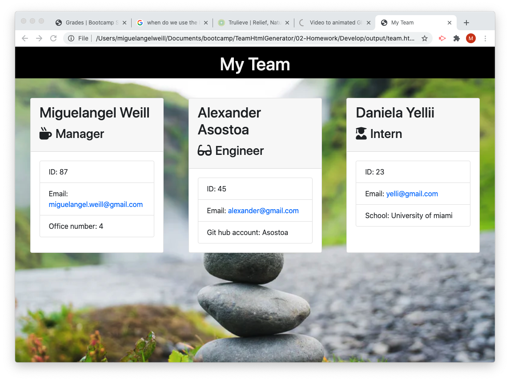

# Team Html Generator
  ## license
  

  ## Description
  This is a team html generator that creates a html file with all of the members of your team and colaborators. This app will dinamically generate the html inside of the output file.
  - When the application runs for the first time we ask the user for the main questions that all of my team members will inherit. 
  - We check if there is already an existing file inside of the output folder with the name of team.html, if it does not exist create it and append the header section to that file, esle dont re-append the header.
  - Checking the role of the team member to ask them their respective questions depending on their respective role on the project.
  - After The user finishes answering the questions we append the card created to the team.html file inside of the output folder .
  - If they wish to add another member I have a recursion happening that triggers the whole process from the beggining. 
  - When done adding team member run the function where I close the team.html file and log to the console that the html has been created succsefully.

  

  ## Table of contents
- [Description](#Description)
- [Installation](#Installation)
- [Usage](#Usage)
- [Licence](#License)
- [Contributors](#Contributors)
- [Test](#Test)
- [Repository Link](#Repository)
- [GitHub Info](#GitHub)

  ## Installation
  Clone this repository

  ## Usage
  To generate a proffesional looking HTML page with all of the team members inside of your group.

  ## Constributors
  Miguelangel Weill

  ## Test

  

  ## Git hub user name
  miguelangelWeill

  ## Repository

[Git hub profile](https://api.github.com/users/Miguelangelweill)
  
[This is my Git Hub repository](https://github.com/Miguelangelweill)

